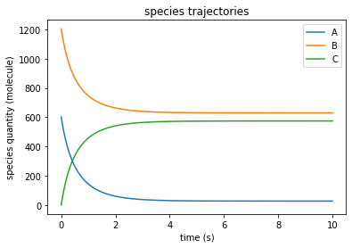
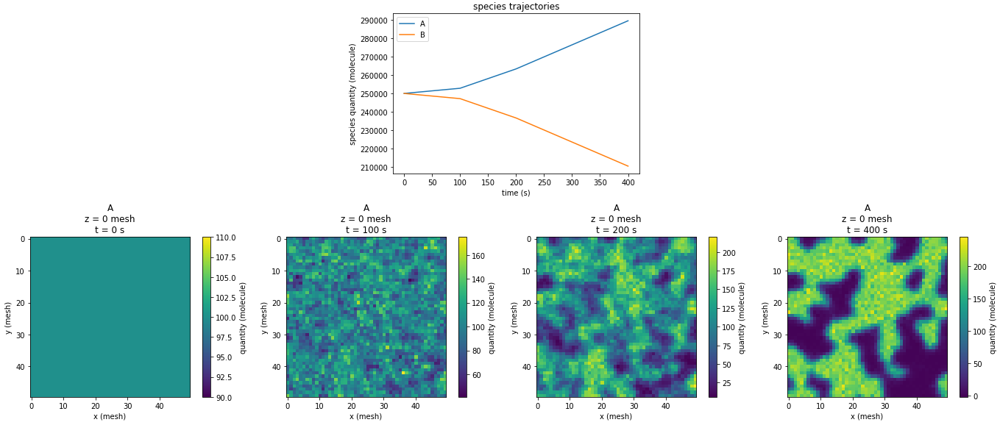
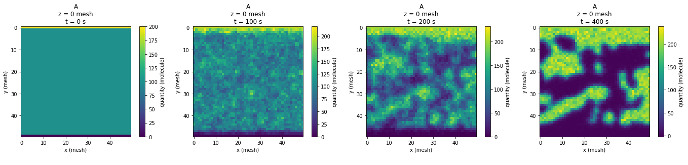
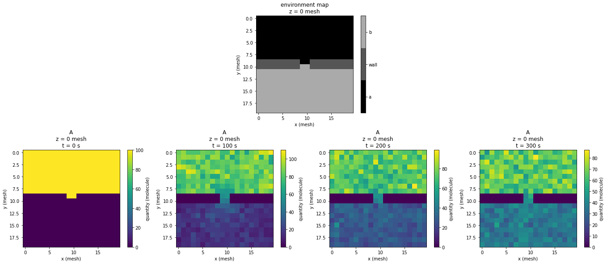
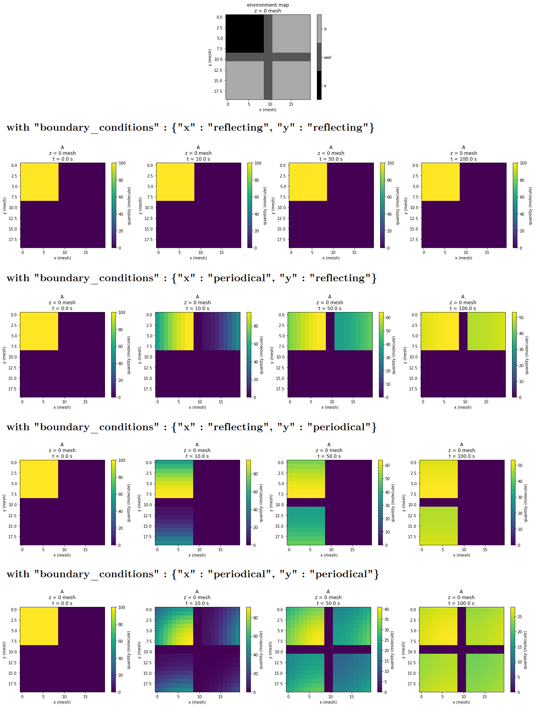

Building a reaction diffusion system and performing simulations
===============================================================

This section illustrate with examples how to build and simulate reaction-diffusion systems
using the different features proposed by Strengths.
For more information about defining specific initial conditions in a system, or processing the simulation output,
please refer to the dedicated sections.

A simple example without diffusion
----------------------------------

Let us consider a simple simulation scenario :

We have a simple reaction network, with two species, *A* and *B*,
and one reaction that goes as

.. math::

  A + B \rightleftharpoons C

with forward and reverse rates

.. math::

  k_+ = 1 \textrm{ µM}^{-1}\textrm{s}^{-1}\\
  k_- = 50 \textrm{s}^{-1}

and with initial densities for *A*, *B* and *C* of

.. math::

  [A]_{t0} = 1 \textrm{ µM}\\
  [B]_{t0} = 2 \textrm{ µM}\\
  [C]_{t0} = 0 \textrm{ µM}

we want to simulate the time trajectory of this system using the Euler method with a time step of 1 ms,
sampling the sate every 10 ms until 10s (in siumlation time).

Eventually, we want to plot the trajectories of *A*, *B* and *C* in one single figure.

This can all be done with the following script :

**system.json** :

.. code:: json

  {
  "network" : {
    "species" : [
      {"label" : "A", "density" : "1 µM"},
      {"label" : "B", "density" : "2 µM"},
      {"label" : "C", "density" : 0}
      ],
    "reactions" : [
      {"stoechiometry" : "A + B -> C", "k+" : "1 µM-1.s-1", "k-" : "50e-3 s-1"}
      ]
    },
  "space" : {
    "cell_volume" : "1 µm3"
    }
  }

**main.py** :

.. code:: python

  import strengths as strn
  import numpy as np
  import strengths.plot as strnplt

  system = strn.load_rdsystem("demo.json")
  output = strn.simulate(
    system = system,
    t_sample = strn.UnitArray(np.linspace(0,10,1001), "s"),
    time_step = "1 ms"
    )
  strnplt.plot_trajectory(output, ["A", "B", "C"])

**matplotlib plot outout** :

let us explain in detail how this example works :

.. code:: python

  import strengths as strn
  import numpy as np
  import strengths.plot as strnplt

first, we imported 3 modules here : strengths (as strn), numpy (as np) and the strengths.plot subodule.
strengths is the Strengths module, which contains everything required to perform simulations.
numpy import is faculatative, it's used in the example for the linspace function, useful to define the sampling times.
the strenghts.plot submodule is also faculatative. It bring conveinient function for trajectory plotting, working as a wrapper around
matplotlib calls.

.. code:: json

  {
  "network" : {
    "species" : [
      {"label" : "A", "density" : "1 µM"},
      {"label" : "B", "density" : "2 µM"},
      {"label" : "C", "density" : 0}
      ],
    "reactions" : [
      {"stoechiometry" : "A + B -> C", "k+" : "1 µM-1.s-1", "k-" : "50e-3 s-1"}
      ]
    },
  "space" : {
    "cell_volume" : "1 µm3"
    }
  }

Next, we define a reaction-diffusion system with a dictionary, in a JSON file (*system.json*).
the dictionary defines two essencial components of the system :

* First, the reaction-diffusion "network", which tells
  which species compose the system, what their properties are and how they interact with each other. More specifically,
  the list of the different species, whith their label/name and expected initial concentration, and a list of the different reactions,
  with their stoechiometric equation and forward and backward rates.
* Second, the system "space", which describes the reaction-diffusion grid in which the different species should evolve.
  It can specify the width, height and depth of the reaction diffusion grid, as well as the volume of an intial grid.
  Since the grid dimension are not specified here, default one are used, that is, width=height=depth=1 cell.

.. code:: python

  system = strn.load_rdsystem("demo.json")

the system is loaded with the :py:func:`load_rdsystem` object, wich reads the json file at the specified location, and returns a
:py:class:`RDSystem` instance built from it.

.. code:: python

  output = strn.simulate(
    system = system,
    t_sample = strn.UnitArray(np.linspace(0,10,1001), "s"),
    time_step = "1 ms"
    )

Next, the trajectory simulation is performed, using the :py:func:`simulate` function. It takes a few arguments :
of course, the reaction diffusion system,
but also the simulation times at which we wish to sample the system state for the trajectory, t_sample,
as well as the simuation time step, which is used in the default Euler method.

:py:func:`simulate` returns a :py:class:`SimulationOutput` object, which contains the trajectory data,
as well a copy of the sampling time and reaction diffusion system. Thus, this object on its own contains everything one need
to start analyzing the data.

.. code:: python

  strnplt.plot_trajectory(output, ["A", "B", "C"])

It is now possible to plot the result. This can be done manually using matplotlib, however, strengths supply some convenient functions
that call matplotlib for us. Here, we can to plot the trajectory of A, B anc C, so we call the :py:func:`plot_trajectory` function,
which takes as argument the simulation output, as well as the list of the labels of the species for which the trajecotory should be plotted.

Alternative ways to define a reaction diffusion system
------------------------------------------------------

Using a JSON file is not the only way to define systems (or reaction networks, cell grids, etc). with strenghts.
actually, there is generally 3 equivalent ways to define such objects, and you should use the one that is the more convienent to you.
Let us take the case of the system in the previous example once more.

1) Through a JSON File

**system.json** :

.. code:: json

  {
  "network" : {
    "species" : [
      {"label" : "A", "density" : "1 µM"},
      {"label" : "B", "density" : "2 µM"},
      {"label" : "C", "density" : 0}
      ],
    "reactions" : [
      {"stoechiometry" : "A + B -> C", "k+" : "1 µM-1.s-1", "k-" : "50e-3 s-1"}
      ]
    },
  "space" : {
    "cell_volume" : "1 µm3",
    "width" : 1,
    "height" : 1,
    "depth" : 1,
    "cell_env" : [0]
    }
  }

.. code:: python

  system = strn.load_rdsystem("demo.json")

This is the way we used previously, the dictionnar describing the system is stored in a separated file,
and the system is created using the :py:func:`loag_rdsystem` function.

2) Through *multiple* JSON Files

**system.json** :

.. code:: json

  {
  "network" : "network.json",
  "space" : "space.json"
  }

**space.json** :

.. code:: json

  {
  "cell_volume" : "1 µm3",
  "width" : 1,
  "height" : 1,
  "depth" : 1,
  "cell_env" : "environments.txt",
  }

**environments.txt** :

.. code:: text

  0

**network.json** :

.. code:: json

  {
  "species" : [
    {"label" : "A", "density" : "1 µM"},
    {"label" : "B", "density" : "2 µM"},
    {"label" : "C", "density" : 0}
    ],
  "reactions" : [
    {"stoechiometry" : "A + B -> C", "k+" : "1 µM-1.s-1", "k-" : "50e-3 s-1"}
    ]
  }

.. code:: python

  system = strn.load_rdsystem("demo.json")

This time, the information have been scattered across diffent files.
This can be especially useful as it allow to put the cell_env array, which can be quite large, outside of the json file,
allowing for more readability.

3) Through a python dict

.. code:: python

  system_dict = {
      "network" : {
        "species" : [
          {"label" : "A", "density" : "1 µM"},
          {"label" : "B", "density" : "2 µM"},
          {"label" : "C", "density" : 0}
          ],
        "reactions" : [
          {"stoechiometry" : "A + B -> C", "k+" : "1 µM-1.s-1", "k-" : "50e-3 s-1"}
          ]
        },
      "space" : {
        "cell_volume" : "1 µm3"
        }
      }

  system = strn.rdsystem_from_dict(system_dict)

It is very similar to the JSON way, however, the dictionary is directly written in python, an thus no oter file is required.
the system is created from the dict using :py:func:`rdsystem_from_dict`. Actually, the JSON way internally uses this function on the
dict it laded from the JSON file.

4) Trough object construction

.. code:: python

  system = strn.RDSystem(
    network = strn.RDNetwork(
      species = [
        strn.Species(label = "A", density = "1 µM"),
        strn.Species(label = "B", density = "2 µM"),
        strn.Species(label = "C", density = 0)
      ],
      reactions = [
        strn.Reaction(stoechiometry = "A + B -> C", kf = "1 µM-1.s-1", kr = "50e-3 s-1")
      ]
    ),
    space = strn.RDGridSpace(
      cell_vol = "1µM"
    )
  )

This way is a bit different, you create a RDSystem from its constructor.

Alternative way to script a simulation
--------------------------------------

in the previous example, we were using the simulate function, which takes the system as argument.
However, we could also be using a simulation script, which is a class that groups together the
simulation parameters. As for other key concepts, simulation scripts can be loaded to/from
python dictionary or JSON files. Simulations from simulation script are launched with the simulate_script function
or using directly a simulation engine

Creating the script
^^^^^^^^^^^^^^^^^^^

using object construction  :

**main.py** :

.. code:: python

  import strengths as strn
  import numpy as np
  import strengths.plot as strnplt

  system = strn.load_rdsystem("demo.json")
  script = RDScript(
    system    = system,
    t_sample  = strn.UnitArray(np.linspace(0,10,1001), "s"),
    time_step = "1 ms"
    )
  output = strn.simulate_script(script)

from python dict :

.. code:: python

  import strengths as strn
  import numpy as np
  import strengths.plot as strnplt

  script_dict = {
    "system"    : "system.json",
    "t_sample"  :  {"value" : np.linspace(0,10,1001), "units" : "s"},
    "time_step" : "1 ms"
    }
  script = rdscript_from_dict(script_dict)
  output = strn.simulate_script(script)

from JSON file :

.. code:: python

  import strengths as strn
  import numpy as np
  import strengths.plot as strnplt

  script = load_rdscript("script.json")
  output = strn.simulate_script(script)

Simulating the script
^^^^^^^^^^^^^^^^^^^^^

using simulate_script :

.. code:: python

  ...

  output = strn.simulate_script(script)

using directly the engine :

.. code:: python

  ...
  engine = MyEngine()
  engine.setup(script)

  while engine.iterate() :
    pass

  output = engine.get_output(script)

Another example with diffusion
------------------------------

In the previous example, we made a system with only one cell, so we didn't have to deal with diffusion.
Let us define a system with diffusion now.

Let us considering the following pattern making couple of reactions :

.. math::

  A + 2 B \rightleftharpoons 3 B
  B + 2 A \rightleftharpoons 3 A

that both have forward and reverse rates

.. math::

  k_+ = 1 \textrm{ µm2}^{-1}\textrm{s}^{-1}\\
  k_- = 0

and with initial densities for *A*, *B* of

.. math::

  [A]_{t0} = [B]_{t0} = 0.01 \textrm{molecule/µm3}\\

as well as diffusion coefficent of
  .. math::

    D = 1 \textrm{µm2/s}\\

for both species.

we want the species to be distributed inside a cell grid
of w=50 * h=50 * d=1 cell, with a cell volume of 1000 µm3.

we want to simulate the time trajectory of this system using the Tau Leap method with a time step of 1 s,
sampling the system state at t=0, 100, 200 and 400s.

Eventually, we want to plot the global trajectories of *A* and *B*,
as well as the species distribution at the various sampling times.

the script is the following :

**system.json** :

.. code:: json

  {
  "rdnetwork" : {
    "units" : {
      "space" : "µm",
      "time" : "s",
      "quantity" : "molecule"
      },
    "species" : [
      {"label" : "A", "density" : 0.1, "D" : 1},
      {"label" : "B", "density" : 0.1, "D" : 1}
      ],
    "reactions" : [
      {"stoechiometry" : "A + 2 B -> 3 B", "k+" : 1, "k-" : 0},
      {"stoechiometry" : "B + 2 A -> 3 A", "k+" : 1, "k-" : 0}
      ]
    },
  "space" : {
    "cell_volume" : 1000,
    "w" : 50,
    "h" : 50,
    "d" : 1
    }
  }

**main.py** :

.. code:: python

  import strengths as strn
  import numpy as np
  import strengths.plot as strnplt

  system = strn.load_rdsystem("system.json")

  output = strn.simulate(
      system = system,
      t_sample = strn.UnitArray([0, 100, 200, 400], "s"),
      time_step = 1,
      engine = strn.engine_collection.tauleap_engine(),
      )

  strnplt.plot_trajectory(output, ["A", "B"])

  for sample in range(output.nsamples()) :
      strnplt.plot_sample_state_2D(output, "A", sample)

**matplotlib plot outouts** :

most of the code above is similar to the previous example,
where we already presented most of it. So instead of repreating,
let us focus on what is new.

First, you may have noticed that in the dictionnary most of the values have been
written without units. Indeed, numeric values are interpreted with the default units system
("units", in the dictionnary), and the expected units dimensions for the value. ie.
"density" = 1 will be the same as "density" = "1 µm-3".

.. code:: python

  strnplt.plot_state_2D(output, "A", sample)

the :py:func:`plot_state_2D`.

A Third Example with chemostats
-------------------------------

Often, it is interesting to study reaction diffusion system driven out of equilibrium.
One interesting feature to emulate such non equilibrium conditions is concept of chemostat.

A chemostat can be seen as a boolean flag that tells if the quantity of a given species at a
given position should be maintained at a fixed value regardless of the events (diffusion/reaction).

let us take the previous example, but this time, impose fixed quantities of A and B at both ends of the system.
at y=0, we want A and B's quantities chemostated at 200 and 0 molecules, while at y=h-1, those should be chemostated
at 200 and 0 molecules.

**main.py**

.. code:: python

  import strengths as strn
  import numpy as np
  import strengths.plot as strnplt

  system = strn.load_rdsystem("system.json")

  # setting A and B quantities chemostated to 200 and 0 on
  # one side of the system, and to 0 and 200 on the other.

  w = system.space.w
  h = system.space.h

  for x in range(system.space.w) :
      system.set_state("A", (x, 0,   0),     200)
      system.set_state("B", (x, 0,   0),     0  )
      system.set_state("A", (x, h-1, 0),     0  )
      system.set_state("B", (x, h-1, 0),     200)

      system.set_chemostat("A", (x, 0,   0), True)
      system.set_chemostat("B", (x, 0,   0), True)
      system.set_chemostat("A", (x, h-1, 0), True)
      system.set_chemostat("B", (x, h-1, 0), True)

  # now we perform the simulation and plot the results
  # exactly as we have done in the previous example

  output = strn.simulate(
      system = system,
      t_sample = strn.UnitArray([0, 100, 200, 400], "s"),
      time_step = 1,
      engine = strn.engine_collection.tauleap_engine(),
      )

  for sample in range(output.nsamples()) :
      strnplt.plot_sample_state_2D(output, "A", sample)

**matplotlib plot outputs**

A fourth example with environments
----------------------------------

one important feature of strengths's reaction diffusion systems is the presence of reaction-diffusion environments.
an environment is a part of the system with its own set of possible reactions and diffusion coefficients.

Let us consider a two 2D system, with only one diffusing species A with a diffusion coefficient of 1 µm2/s.
The system is a 2D grid of 20x20 cells of 1µm3.
The upper half of the system consist info a first environment, the "a" environment,
while the lower half is the "b" environment. A can diffuse freely into both "a" and "b".
the upper and lower halves are separated by a third "wall" environment,
that only let "a" and "b" connect at the center of the system. As its name suggests, A cannot diffuse in this "wall"
environment.
initially, A have a density of 100 molecule/µm3 in the "a" environment but is absent from "b" and "wall" environments.
we simulate the diffusion of A, sampling the system state at t=0, 100, 200 and 300 s, and plot the sampled states.

**system.json**

.. code:: json

  {
  "network" : {
    "environments" : ["a", "wall", "b"],
    "species" : [
      {"label" : "A", "density" : {"a" : 100, "b" : 0, "wall" : 0}, "D" : {"a" : 1, "b" : 1, "wall" : 0}}
      ],
    "reactions" : [
      ]
    },
  "space" : {
    "cell_env" : [0,0,0,0,0,0,0,0,0,0,0,0,0,0,0,0,0,0,0,0,
                  0,0,0,0,0,0,0,0,0,0,0,0,0,0,0,0,0,0,0,0,
                  0,0,0,0,0,0,0,0,0,0,0,0,0,0,0,0,0,0,0,0,
                  0,0,0,0,0,0,0,0,0,0,0,0,0,0,0,0,0,0,0,0,
                  0,0,0,0,0,0,0,0,0,0,0,0,0,0,0,0,0,0,0,0,
                  0,0,0,0,0,0,0,0,0,0,0,0,0,0,0,0,0,0,0,0,
                  0,0,0,0,0,0,0,0,0,0,0,0,0,0,0,0,0,0,0,0,
                  0,0,0,0,0,0,0,0,0,0,0,0,0,0,0,0,0,0,0,0,
                  0,0,0,0,0,0,0,0,0,0,0,0,0,0,0,0,0,0,0,0,
                  1,1,1,1,1,1,1,1,1,0,0,1,1,1,1,1,1,1,1,1,
                  1,1,1,1,1,1,1,1,1,2,2,1,1,1,1,1,1,1,1,1,
                  2,2,2,2,2,2,2,2,2,2,2,2,2,2,2,2,2,2,2,2,
                  2,2,2,2,2,2,2,2,2,2,2,2,2,2,2,2,2,2,2,2,
                  2,2,2,2,2,2,2,2,2,2,2,2,2,2,2,2,2,2,2,2,
                  2,2,2,2,2,2,2,2,2,2,2,2,2,2,2,2,2,2,2,2,
                  2,2,2,2,2,2,2,2,2,2,2,2,2,2,2,2,2,2,2,2,
                  2,2,2,2,2,2,2,2,2,2,2,2,2,2,2,2,2,2,2,2,
                  2,2,2,2,2,2,2,2,2,2,2,2,2,2,2,2,2,2,2,2,
                  2,2,2,2,2,2,2,2,2,2,2,2,2,2,2,2,2,2,2,2,
                  2,2,2,2,2,2,2,2,2,2,2,2,2,2,2,2,2,2,2,2],
    "w" : 20,
    "h" : 20,
    "d" : 1
    }
  }

**main.py**

.. code:: python

  import strengths as strn
  import numpy as np
  import strengths.plot as strnplt

  system = strn.load_rdsystem("system.json")

  strnplt.plot_environments_2D(system)

  output = strn.simulate(
      system = system,
      t_sample = strn.UnitArray([0, 100, 200, 300], "s"),
      time_step = 0.01,
      engine = strn.engine_collection.tauleap_engine(),
      )

  for sample in range(output.nsamples()) :
      strnplt.plot_sample_state_2D(output, "A", sample)

**matplotlib plot outputs**

Defining boundary conditions
----------------------------

By default, reflecting boundary conditions are applied for diffusion.
However, it is possible to specify which condition to apply. For now, only two types of
boundary conditions are available : "reflecting" and "periodical".
it is possible to specify the boundary conditions for each axis ("x", "y" and "z").

As an axemple, let us consider a 2D system crossed by a barrier in the middle along the x and y axes.
As a consequence, the system is split in 5 areas : the upper left, upper right, lower left and lower right sections and the barrier.
A species "A", initially only present in the upper left section, is diffusing everywhere except in the barrier.
Let us see what happens when we apply different boundary conditions to this system :

**system.json**

.. code:: json

  {
  "rdnetwork" : {
    "environments" : ["a", "wall", "b"],
    "species" : [
      {"label" : "A", "density" : {"a" : 100, "b" : 0, "wall" : 0}, "D" : {"a" : 1, "b" : 1, "wall" : 0}}
      ],
    "reactions" : [
      ]
    },
  "space" : {
    "cell_env" : [0,0,0,0,0,0,0,0,0,1,1,2,2,2,2,2,2,2,2,2,
                  0,0,0,0,0,0,0,0,0,1,1,2,2,2,2,2,2,2,2,2,
                  0,0,0,0,0,0,0,0,0,1,1,2,2,2,2,2,2,2,2,2,
                  0,0,0,0,0,0,0,0,0,1,1,2,2,2,2,2,2,2,2,2,
                  0,0,0,0,0,0,0,0,0,1,1,2,2,2,2,2,2,2,2,2,
                  0,0,0,0,0,0,0,0,0,1,1,2,2,2,2,2,2,2,2,2,
                  0,0,0,0,0,0,0,0,0,1,1,2,2,2,2,2,2,2,2,2,
                  0,0,0,0,0,0,0,0,0,1,1,2,2,2,2,2,2,2,2,2,
                  0,0,0,0,0,0,0,0,0,1,1,2,2,2,2,2,2,2,2,2,
                  1,1,1,1,1,1,1,1,1,1,1,1,1,1,1,1,1,1,1,1,
                  1,1,1,1,1,1,1,1,1,1,1,1,1,1,1,1,1,1,1,1,
                  2,2,2,2,2,2,2,2,2,1,1,2,2,2,2,2,2,2,2,2,
                  2,2,2,2,2,2,2,2,2,1,1,2,2,2,2,2,2,2,2,2,
                  2,2,2,2,2,2,2,2,2,1,1,2,2,2,2,2,2,2,2,2,
                  2,2,2,2,2,2,2,2,2,1,1,2,2,2,2,2,2,2,2,2,
                  2,2,2,2,2,2,2,2,2,1,1,2,2,2,2,2,2,2,2,2,
                  2,2,2,2,2,2,2,2,2,1,1,2,2,2,2,2,2,2,2,2,
                  2,2,2,2,2,2,2,2,2,1,1,2,2,2,2,2,2,2,2,2,
                  2,2,2,2,2,2,2,2,2,1,1,2,2,2,2,2,2,2,2,2,
                  2,2,2,2,2,2,2,2,2,1,1,2,2,2,2,2,2,2,2,2],
    "w" : 20,
    "h" : 20,
    "d" : 1,
    "boundary_conditions" : {"x" : "reflecting", "y" : "reflecting"}
    }
  }

**main.py**

.. code:: python

  import strengths as strn
  import numpy as np
  import strengths.plot as strnplt

  system = strn.load_rdsystem("system.json")

  strnplt.plot_environments_2D(system)

  output = strn.simulate(
      system = system,
      t_sample = strn.UnitArray([0, 10, 50, 100], "s"),
      time_step = 0.01
      )

  for sample in range(output.nsamples()) :
      strnplt.plot_sample_state_2D(output, "A", sample)

**matplotlib plot outputs**

