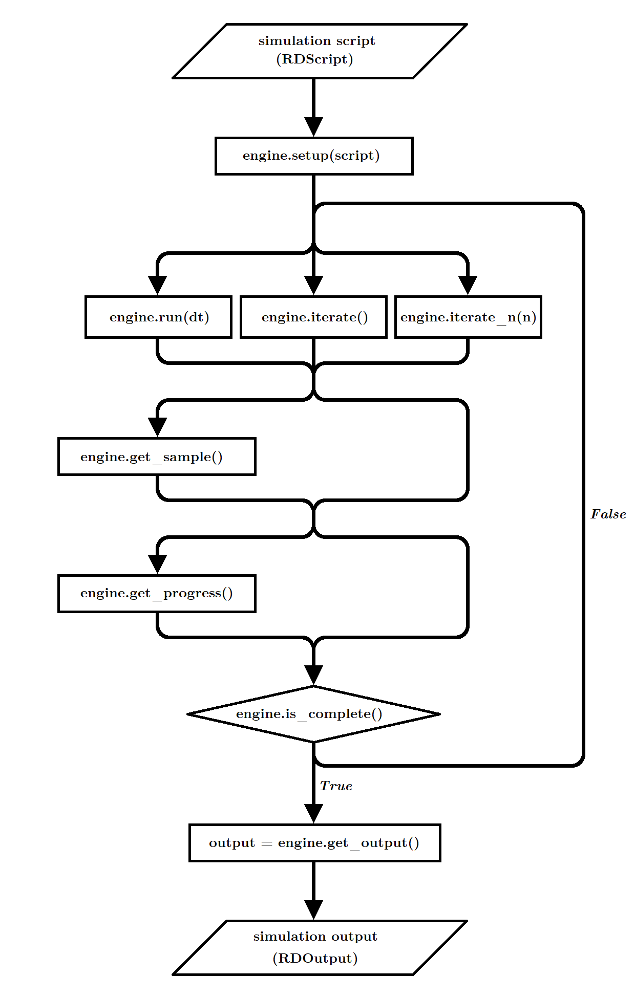

Simulation Engines
==================

What is a simulation engine
---------------------------

A simulation engine is a class that represents a reaction-diffusion simulation algorithm.
The *RDEngineBase* base class defines an abstract common interface for simulation algorithms,
and any engine can be seen as a particular implementation of the RDSimulationEngineBase class.
Using an engine to perform a simulation requires respect to some sequence of events (see the engine flow chart below).

* First, the engine is initialized from a simulation script (RDScript) by calling engine.setup. This is the step where the simulation algorithm builds its internal state. This is also at this stage that the system is sampled at *t*=0.
* Next comes the simulation loop. This is the stage during which the system evolution is actually simulated. iterations of the simulation algorithm are executed by calling either engine.run(dt), engine.iterate() or engine.iterate_n(n). All those functions ultimately do the same thing, the difference being that:

  * iterate() run a single iteration
  * interate_n(n) run n iteration in a row
  * run(dt) run iterations for a period of (out-simulation) time dt.

  The advantage of using iterate_n and run functions
  rather than iterate, in the case of engines relying on compiled dynamic libraries, is that there are fewer back-and-forths between Python and the library.
  Those functions will return False or True depending on whether the simulation is complete or not. The completeness status of the simulation can also
  be consulted by calling the engine.is_complete() method, which will return true if the simulation is complete.
  Once the simulation is complete, the iterations will not have any effect anymore, so the only thing to do is to end the loop phase.
  During the loop phase, there is also the possibility to consult the progress percentage of the simulation using engine.get_progress,
  or to manually sample using engine.sample() (useful when the sampling_policy="no_sampling" in the engine.initialize arguments).
* last step, once the simulation is complete, is to get the output (a RDSimulationOutput object), using engine.get_output().

Here is an example, where MyEngine() is some implementation of the RDSimulationEngineBase class:

.. code:: python

  script = load_rdscript("script.json")
  engine = MyEngine()

  engine.setup(script)

  while engine.iterate() :
    pass

  output = engine.get_output()

For common use, it may be more convenient to use the simulate or simulate_script functions, which wrap the engine dynamics.
The simulate_script function takes as argument a script and an engine:

.. code:: python

  script = load_rdscript("script.json")
  engine = MyEngine()

  output = simulate_script(
    script = script,
    engine = engine
    )

While the simulate function takes an engine as well as script parameters:

.. code:: python

  system = load_rdsystem("system.json")
  engine = MyEngine()

  output = simulate(
    system = system,
    t_sample = [1,10,100],
    time_step = 0.001,
    engine = engine
    )

Engine implementations installed with Strengths
-----------------------------------------------

All engines implement diffusion using the method described by David Bernstein [1].
Strengths comes with 4 engines implementing different methods, relying on a shared library compiled from C++. 
Those can be instantiated using the four following methods, from the engine_collection submodule,
which are directly imported with ``import strengths``: 

* strenghts.engine_collection.euler_engine(), implementing an Euler method with a static time step
* strenghts.engine_collection.euler_adapt_engine(), implementing an Euler method with an adaptative time step
* strenghts.engine_collection.gillespie_engine(), implementing the Gillespie algorithm [3]
* strenghts.engine_collection.tauleap_engine(), implementing the tau leap approximation to the Gillespie algorithm [2]

Another engine relies on the ODE solvers [5] from the SciPy package [4] for deterministic simulations:

* strengths.scipyrdengine.ScipyRDEngine()

References
----------

* [1] Bernstein, D. (2005). Simulating mesoscopic reaction-diffusion systems using the Gillespie algorithm. Physical Review E, 71(4), Article 041103. https://doi.org/10.1103/PhysRevE.71.041103
* [2] Gillespie, D. T. (2001). Approximate accelerated stochastic simulation of chemically reacting systems. The Journal of Chemical Physics, 115(4), 1716-1733. https://doi.org/10.1063/1.1378322
* [3] Gillespie, D. T. (1977). Exact stochastic simulation of coupled chemical reactions. The Journal of Physical Chemistry, 81(25), 2340-2361. https://doi.org/10.1021/j100540a008
* [4] Scipy website. (accessed in 2025). https://scipy.org/
* [5] Scipy online documentation. (accessed in 2025). https://docs.scipy.org/doc/scipy/reference/integrate.html#module-scipy.integrate
