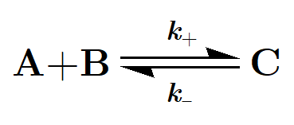

The fundamental concepts
========================

object concepts
---------------

Species (Species class)
^^^^^^^^^^^^^^^^^^^^^^^

A chemical species is a type of molecule. A system typically comport multiple instances of any species across its space.
Species can diffuse and be consumed or produced in reactions.

Reaction (Reaction class)
^^^^^^^^^^^^^^^^^^^^^^^^^

A chemical transformation, or reaction, is an event localized in space during which some substrate species molecules are converted to some product species molecules.
Reactions are thus represented through their stoechiometric equation :

means that when one molecule of species A collide with a molecule of species B, they can form the a complex, which is another molecule of species C (second order reaction), with a
reaction rate constant k+, and that the molecule of C can at any moment break down into a molecule of A and a molecule of C, which is the reverse reaction, (first order), whit a rate constant k-.

Network (RDNetwork class)
^^^^^^^^^^^^^^^^^^^^^^^^^

A reaction diffusion network define a set of coupled species and reactions, along with the environments in which they can exist.

Space (RDSpace class)
^^^^^^^^^^^^^^^^^^^^^

A 3D grid of reaction volumes - that we call cells - that constitute the reaction diffusion system space.
The grid is defined by its dimensions (width, height, depth) and the volume of an individual cell.
Each cell can be assigned some environment (reffering to an environment defined in a reaction diffusion network).

System (RDSystem class)
^^^^^^^^^^^^^^^^^^^^^^^

A reaction diffusion system is a system in the physical sense, a system associate a reaction-diffusion network and a space,
and is characterized by a state, corresponding to the distribution of the different network species quantities in each cell of the system space.
A system also defines how its species are chemostated (chemostats are defined species wise and cell wise).

Script (RDScript class)
^^^^^^^^^^^^^^^^^^^^^^^

A reaction diffusion simulation groups together every simulation parameters, that a simulation engine needs to fully carry out a simulation.
It associates a system with the algorithm and sampling parameters.

Engine (RDEngineBase derived class)
^^^^^^^^^^^^^^^^^^^^^^^^^^^^^^^^^^^

Reaction diffusion simulation engines are objects that actually carry out the simulations.
An engine implements some reaction-diffusion algorithm/method.

Output (RDOutput class)
^^^^^^^^^^^^^^^^^^^^^^^

A reaction diffusion simulation output is the output return by a simulation engine, once the simulation is complete.
It contains the simulation script that have been used for the simulation as well as the trajectory of its system.

other concepts
--------------

cells
^^^^^^

The cell is the unit component of the system space.
its an individual cubic volume of the system space in which species
can transform and diffuse from/to neighbor cells.
in a 3D space, a cell have a maximum of 6 neighbors.

environments
^^^^^^^^^^^^

an environment is a type of cell.
some object porperties, such as species initial densities, chemostate and diffusion coefficient,
and reaction possibility, can be set to different values depending on the environment.
This is the feature that enable the creation of inhomogeneous systems.

chemostats
^^^^^^^^^^

a chemostat refers to a process maintaining a species quantity at a constant level.
any species can be defined as chemostated, globally, in certain environments, or locally (cell wise).
a species defined as chemostated at some place will have a quantity maintained as constant during simulations.
