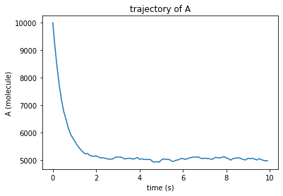
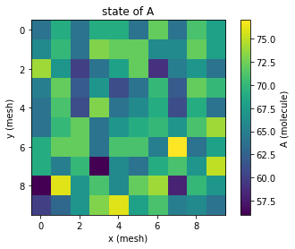

Working the simulation output
=============================

what is in the simulation output ?
----------------------------------

the RDTrajectory object returned by simulate, simulate_script or engines's get_output method contains the trajectory data,
as well as every contextual information needed to interpret those data, such as the simulation scrip (RDScript)
and the engine option and description.

Let us consider the simple system

.. code:: json

  {
  "network" : {
    "species" : [
      {"label" : "A", "density" : 100},
      {"label" : "B", "density" : 0}
      ],
    "reactions" : [
      {"eq" : "A -> B", "k+" : 1, "k-" : 1}
      ]
    },
  "space" : {"w" : 10, "h" : 10}
  }

the system is loaded in python and a simulation is performed:

.. code:: python

  import strengths as strn
  import numpy as n

  system = strn.load_rdsystem("system.json")
  output = strn.simulate(system = system, t_sample = [0, 100, 200])

output, returned by simulate, is the RDTrajectory object.

Accessing trajectory data
-------------------------

Let us say that we want to know the quantity of the "A" species in the cell at coordinates (x=3,y=4,z=0) at time
t=200s. This can be done using the get_trajectory_point method, which allow to get the quantity of molecules of a given species at a given position for a given sample. Thus, it is necessary to determine which sample correspond to t=200s. This can be done using
the get_sample_index, which return the sample index for which the sampling time is the closest from a given time :

.. code:: python

  sample = output.get_sample_index("200 s")
  point = output.get_trajectory_point(species="A", sample=sample, position=(3,4,0))

point will be a UnitValue with quantity of matter units ("molecule", "mol", etc.).

Now, if one want to get the state for a given species, this can be done using the get_state,
which works as get_trajectory_point, except it doesn't have the position argument, and returns
a UnitArray.

.. code:: python

  sample = output.get_sample_index("200 s")
  state = output.get_state(species="A", sample=sample)

if the species argument is set to ``None``, get_state will return the whole system state for the given sample.

.. code:: python

  sample = output.get_sample_index("200 s")
  state = output.get_state(None, sample=sample)

Finally, if one want to get the trajectory of a given species, one can use the
get_trajectory method. As for the previous functions, the first parameter is the species of interest.
Also, as for the previous functions, the behavior depend on the other arguments.

calling the function without other argument

.. code:: python

  trajectory = output.get_trajectory("A")

will return an array containing all the successive states of A (so, an array of UnitArrays).
Calling the function specifying the position argument

.. code:: python

  trajectory = output.get_trajectory("A", position=(0,0,0))

will a UnitArray corresponding to the
trajectory of A at this specific position in the system.
Eventually, calling the function mith ``merge=True``

.. code:: python

  trajectory = output.get_trajectory("A", merge=True)

will return a UnitArray corresponding to the
trajectory of the global quantity of A in the whole system.

examples
--------

The following examples will illustrate how to plot system states and trajectories directly using `Matplotlib <https://matplotlib.org>`_ without the strengths.plot submodule.

use case 1 : Plotting a trajectory
^^^^^^^^^^^^^^^^^^^^^^^^^^^^^^^^^^

Now, let us apply what we've seen in the previous section by plotting the trajectory of a
species directly with matplotlib without relying the strengths.plot submodule.
We use the same system ("system.json") that we've defined before.

.. code:: python

  import strengths as strn
  import matplotlib.pyplot as plt

  #loading the system
  system = strn.load_rdsystem("system.json")

  #running the simlulation
  t_sample = [0.1*i for i in range(0, 100)]
  output = strn.simulate(system, t_sample=t_sample, engine=strn.engine_collection.gillespie_engine())

  # we get the global trajectory of A and the corresponding times.
  A = output.get_trajectory("A", merge=True)
  t = output.t

  #title
  plt.title("trajectory of A")

  #axis names, with associated units
  plt.xlabel("time ("+str(t.units)+")")
  plt.ylabel("A ("+str(A.units)+")")

  #plot
  plt.plot(t.value, A.value)

  plt.show()

use case 2 : Plotting a sampled system state
^^^^^^^^^^^^^^^^^^^^^^^^^^^^^^^^^^^^^^^^^^^^

Here is another example :  the simulation is the same, except we want display the state of A
at t= 0.5 s, once more with matplotlib and without strengths.plot.

.. code:: python
  
  import strengths as strn
  import matplotlib.pyplot as plt

  #loading the system
  system = strn.load_rdsystem("system.json")

  #running the simlulation
  t_sample = [0.1*i for i in range(0, 100)]
  output = strn.simulate(system, t_sample=t_sample, time_step=0.001, engine=strn.engine_collection.gillespie_engine())

  # we get the global trajectory of A and the corresponding times.
  sample = output.get_sample_index("0.5 s")
  A_state = output.get_state("A", sample=sample)

  #title
  plt.title("state of A")

  #axis names, with associated units
  plt.xlabel("x (cell)")
  plt.ylabel("y (cell)")

  #plot
  #(h comes befor w when reshaping)
  plt.imshow(
      A_state.value.reshape(system.space.h, system.space.w)
      )
  plt.colorbar(label="A ("+str(A_state.units)+")")

  plt.show()

